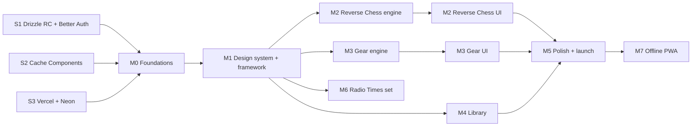

# Ludwig: Implementation Plan

Status: draft · 2026-10-01 · Companion to [`SPEC.md`](./SPEC.md)

This document sets the overall build strategy: the order of work, how it is sliced, what "done" means, and where the risks are. `SPEC.md` is the source of truth for _what_ we build. If the two disagree, the spec wins, and this plan gets updated. Individual tickets are written from the epics in section 6.

---

## 1. Strategy in one paragraph

Prove the riskiest plumbing first: Next 16 with Drizzle 1.0 RC, Better Auth, Neon and Vercel. Then build the design system before any real screen, so nothing gets styled twice. Next, put **one** simple puzzle type through the whole framework (registry, server-side checking, autosave, Casebook) to make a walking skeleton. Build the two flagship puzzles **engine-first**: pure TypeScript, test-driven and verified for uniqueness, before any UI touches them. Only then widen into the rest of the library, where each new type is a near-mechanical repeat of the skeleton pattern. Polish and the title-sequence landing come last.

---

## 2. Principles

1. **Vertical slices.** Every ticket that touches UI delivers something usable end to end: DB, server, client and test. No "backend only" tickets for user-facing features. Pure engines are the exception and ship with their tests.
2. **Engines are pure and tested first.** `engine.ts` and `check.ts` have no React, no DB and no Next imports. Write them against Vitest fixtures before building the solver UI. Since they're pure functions, test-driven development comes cheaply.
3. **Solutions never reach the client.** This is enforced structurally: `solution` is only read inside `server-only` modules, and a lint rule or a test asserts that client-facing data access never selects it.
4. **The design system before screens.** Tokens, fonts, textures, brand components and the restyled shadcn set land in M0–M1. Screens built afterwards compose them and never introduce new colours or radii.
5. **Content is code.** Curated puzzles live as typed TypeScript or JSON files in the repo (`content/<type>/…`), validated by the type's Zod schemas, uniqueness-checked by `puzzles:verify` in CI, and loaded into Postgres by `db:seed`. This gives reviewable diffs, rollbacks and preview branches with real content for free.
6. **Pattern before breadth.** The first puzzle type sets the pattern (folder shape, registry entry, solver props, tests). Later types copy it. If a new type needs a framework change, that change gets its own ticket, rather than being bent in quietly.
7. **No speculative abstraction.** Extract shared solver pieces (grid cell input, timer, check bar) only once a second type actually needs them.
8. **The database is strict 3NF, and the database enforces it** (`SPEC.md` section 7.4.1):
   - no `jsonb` or array columns;
   - no polymorphic FKs, with class-table inheritance for puzzle types;
   - derived values are computed, not stored;
   - the only redundancy is the list in `SPEC.md` section 7.4.5, and it is maintained by composite FKs and fill triggers, never by app code;
   - enums over checks where possible, and lookup tables only when an option carries attributes.

   Every schema PR is reviewed against these rules.
9. **Read the docs that ship with the code.** Next 16 lives in `node_modules/next/dist/docs/`, and react-chessboard v5, Better Auth 1.7 and Drizzle 1.0 RC have all changed APIs. Every ticket that uses one links the relevant doc page.

---

## 3. Phases

The milestone names match `SPEC.md` section 9. Each phase lists its goal, deliverables, exit criteria, and anything that must be decided or spiked first.

### M0: Foundations and risk spikes

**Goal.** A deployable, authenticated, branded empty shell on Vercel and Neon, with every pre-release dependency proven.

**Spikes.** Each is time-boxed, and each ends with a short note in the PR description:

- **S1: Drizzle 1.0 RC + Better Auth 1.7 + drizzle-kit.**
  - Generate the Better Auth schema into `src/db/auth-schema.ts` and migrate on local Docker.
  - Prove sign-up, sign-in and sign-out with a Playwright test.
  - **Fallback if it blocks:** Drizzle 0.45 plus `drizzle-zod` (see `SPEC.md` section 7.1).
- **S2: Cache Components.**
  - Enable `cacheComponents` and confirm that the session-dependent nav behind `<Suspense>`, plus `use cache` on a dummy payload query, both build and deploy.
  - **Decision recorded:** whether it is on for v1. Recommended: on.
- **S3: Vercel + Neon.**
  - Marketplace integration, preview branch per PR, `db:migrate` in the build, and `attachDatabasePool` with `pg`.
  - Verify that a preview deploy gets its own Neon branch and that sign-in works on the preview URL (`trustedOrigins`).

**Deliverables:**

- Tooling:
  - Vitest and Playwright set up.
  - GitHub Action for typecheck, lint, test and `puzzles:verify` (a stub for now).
  - `compose.yaml` for local Postgres.
  - Zod-validated `src/env.ts`.
  - `package.json` scripts from spec section 7.6.
- **Database:**
  - Drizzle client (`src/db/index.ts`).
  - Core tables from spec section 7.4.3: lookups, the `puzzles` supertype, volumes, `weekly_puzzles`, `attempts`, `attempt_hints` and `user_settings`.
  - Relations and the first migration.
  - Custom SQL migrations for the generic triggers: `puzzles_require_subtype` and `attempts_fill_type_key`.
  - A Vitest DB-integrity harness against local Postgres, which later types extend.
- **Auth:** Better Auth config, route handler, auth client, `proxy.ts`, and sign-in/sign-up pages. These are functional, with basic brand styling.
- **Design-system base:**
  - Colour tokens and the shadcn variable mapping in `globals.css`, for both the Paper and Ink themes.
  - Fonts through `next/font`.
  - Grain overlay, square radius everywhere.

**Exit criteria:**

- A preview URL lets someone sign up and sign in, and shows paper-textured pages in the correct fonts.
- CI is green.
- All spike decisions are written into `SPEC.md`.

### M1: Design system and puzzle framework (walking skeleton)

**Goal.** One puzzle type fully playable, signed in or out, with progress saved and shown in the Casebook. The design system is complete enough that later screens need no new primitives.

**Deliverables:**

- **Brand components:** `Wordmark` (our SVG), `Credit` (stacked caps), `InkSplat`, `Walker` (loading), `SolvedStamp`, `GridPaper`, `Raking`.
- **Restyled shadcn set** from spec section 6.4. A `/dev/kitchen-sink` route renders every component in both themes. It is only available in dev and preview builds.
- **Puzzle framework:**
  - `puzzles/registry.ts` and the per-type folder contract.
  - `getPuzzleForPlay` data access, which never selects `solution`.
  - Server actions: `checkAnswer`, `saveState`.
  - Merging `localStorage` progress into the account on sign-up.
- **Solve-page chrome:** header, timer, Check/Reveal/Reset, completion state.
- **Pages:** collection index, category index and solve page routing (`/puzzles/[type]/[slug]`), and a basic Casebook.
- **Pilot type: `anagram`.** It is the simplest UI and still exercises answer checking, hints and autosave. It is also the first full use of the subtype pattern and the per-type folder (`tables.ts`, `schema.ts`, `load.ts`, `check.ts`, `derive.ts`).
- **Second type: `crossword`, quick style.** Picked because it forces child tables, derived clue numbers and the shared `CellInput` grid, which the cryptic crossword, logic grid, sudoku and futoshiki all reuse.
- **Content pipeline:** `content/` folder, `db:seed` (supertype, subtype and children in one transaction per puzzle), and `puzzles:verify` running the type checkers against every content file. See spec section 4.6.

**Exit criteria:**

- End-to-end tests 1 and 2 from spec section 8.2 pass on a preview deploy.
- The brand checklist (spec section 8.3) passes on every M1 screen.

### M2: Reverse Chess

**Goal.** Modes A and B are playable, with 10 curated, verified puzzles.

**Order:**

1. **Tables and FEN derivation.** Pieces stored as rows, with the FEN derived in `derive.ts`.
2. **Retro-move engine.** Apply retro moves (normal moves, uncapture, unpromote, en passant, castling), then validate the prior position, replay it forward with `chess.js`, and compare.
3. **Enumerator and uniqueness verifier** for Mode A, wired into `puzzles:verify`.
4. **Board component.** react-chessboard v5 with the cburnett pieces restyled white with long shadows, a backwards red arrow, and an uncapture tray.
5. **Mode A UI and content.**
6. **Mode B.** Incremental chain validation, plus the descriptive-notation formatter and setting.
7. **Hub page** `/reverse-chess`.

Mode D (the Rota) is deferred to M4 as its own `rota` type. It has its own engine and tables and no chess dependency, so it doesn't belong on M2's critical path.

**Exit criteria:** end-to-end test 3 passes, and all curated positions pass the verifier and a manual legality review.

### M3: The Gear Puzzle

**Goal.** The flagship gear puzzle is playable: curated diagrams, a daily seeded diagram, and the Fix the Diagram variant.

**Order:**

1. **Engine core:**
   - mesh 2-colouring;
   - tooth arithmetic;
   - convergence state (`slot`, `facing`, `sees`);
   - win-condition search over L × 8.

   Use hand-computed fixtures.
2. **Generator** with seeded PRNG and uniqueness filtering, plus the Fix the Diagram generator with the unique-repair check.
3. **`puzzles:gen-gears`,** which materialises daily diagrams for a date range.
4. **SVG board**, static render of one convergence.
5. **Crank interaction** (drag, keyboard, ±): the whole gear train turns live.
6. **Dance scrubber and animation** (`motion`), plus sightlines at each convergence.
7. **Accuse flow and server check.**
8. **Fix the Diagram UI.**
9. **Accessible state table.**
10. **Hub page** `/gears`.

**Exit criteria:** end-to-end test 4 passes. The generator emits only unique diagrams across 10,000 seeds in a test. Performance on a mid-range phone is 60 fps while scrubbing.

### M4: Library breadth

**Goal.** Every remaining type in spec section 2.3 is playable, with launch content. Each type is one ticket, or two if it needs a generator. Types are grouped by shared UI so each group reuses what the first type in it built:

| Group | Types | Shared piece built by the first type in the group |
|---|---|---|
| Cell grids | crossword (cryptic style), logic-grid (including the false-statement variant), sudoku, futoshiki | `CellInput` grid (from M1), constraint overlays |
| Word | word-ladder, acrostic, word-search ("The Fob-Off") | Letter tiles, highlight-path selection |
| Cipher | caesar, keyword, book-cipher, pictogram-cipher | Cipher-key panel, substitution input |
| Logic text | knights-knaves, odd-one-out, napkin-maths | Statement list with toggles |
| Spatial | sightlines, cctv-maze | Shared grid-plus-cone visibility engine (`src/puzzles/_shared/visibility.ts`) |
| Visual | spot-difference | Seeded SVG scene generator |
| Case | `rota` (Reverse Chess Mode D) | `rota.ts` engine, clue-kind subtype tables, swap-stack UI |
| Mechanism | `gear-train` (Gear Puzzle Mode B, "Classic Gear Train") | Shared `spinSigns` in `_shared/`, pegboard, placement tray |

Plus **This Week**: the `weekly_pairs` seed and the `/this-week` page.

**Exit criteria:** every type has at least 5 curated puzzles (3 for cryptic) passing `puzzles:verify`, and end-to-end test 5 (a keyboard-only sudoku) passes.

### M5: Polish and launch

**Deliverables:**

- **Bullet-hole view transition**, with a fallback for reduced motion.
- **Title-sequence landing:** grid rooms, the walker, and toppled white pieces with a raking-light hero.
- **Mirrored-digit backgrounds.**
- **Accessibility audit:** axe in Playwright on every route type, and a manual screen-reader pass of one solver per group.
- **Performance pass:** Lighthouse targets from spec section 8.3, font subsetting, grain PNG size.
- **Settings page** (theme, notation, reduced motion).
- **Phones and PWA** (T112–T117, research in `docs/research/mobile.md`):
  - the PWA baseline (manifest, icons, theme colour, safe areas, install hint);
  - solve mode, a full-height layout for the solve page on touch phones;
  - a shared on-screen `PuzzleKeyboard`, so the clue and the grid stay in view while typing, adopted by the crossword, sudoku, futoshiki and the ciphers;
  - a touch pass (44px targets, chess tap-to-move, a WebKit iPhone project).

  These land before the accessibility audit and the performance pass, so both cover the layout we launch with.
- **Look and feel fixes** (T120–T128, audit in `docs/research/look-and-feel-audit.md`): theme-aware dark surfaces and light cast shadows in Ink, chess piece outlines, the solved-footer tear, a simpler bullet route transition, disabled/error/focus states, grid line rendering, a themed 404, book cipher line layout and per-page polish.
- **Puzzle previews** (T129–T130): a static preview per type drawn from the payload, shown on shelf cards and on the Collection type cards.

  Both land before the accessibility audit and the performance pass.
- **Footer** with the cburnett attribution and the not-affiliated note.
- **Production domain,** a final seed, launch.

**Exit criteria:** the whole of spec section 8 passes on production.

### M6: Radio Times set

**Goal.** The types from the Radio Times _Ludwig Puzzle Special_ and the extra KrazyDad formats are playable (spec sections 1.2.1 and 2.4), and the grid types can be generated deterministically from a seed. M6 is not on the launch path. Its tickets depend only on M1 and on the types they extend, so they can run alongside M5 or after launch, and the M5 audits don't wait for them.

**Order and grouping:**

| Group | Types | Reuses |
|---|---|---|
| Cell grids | sudoku variants (jigsaw, rainbow, killer, XV), star-battle, troix, circle9, fillomino, kakuro | Sudoku cell UI and notes (T046), `CellInput`. The region-border overlay built for jigsaw sudoku is reused by star battle, norinori and the killer cages |
| Shading | nonogram, norinori | `CellInput` focus model; one shared fill/cross/dot mark cycle, built by whichever lands first |
| Chess | chess-problem | Board component (T028), chess enums and the FEN derivation (T025) |
| Spatial | railroad, reflections | `CellInput` grid focus and keyboard model (T021). Each solver draws its own glyphs (track pieces, mirrors) |
| Word | word-wheel | Letter tiles (T049), `words` dictionary widened to 9 letters |
| Visual | detective-scene | The spot-difference server-side hit-test (T061). The artwork is a separate content ticket |
| Generators | sudoku and futoshiki first, then whichever types T099 recommends | `_shared/prng.ts` (mulberry32), each type's `countSolutions` |

**Generators.** T099 is research only. It reads the KrazyDad blog closely, compares its approach with how we build puzzles today (curated by hand, apart from the gears and spot-difference generators), and writes up a recommendation with follow-up tickets. T100 builds the shared deterministic generator pipeline and the first two generators. The bar comes from KrazyDad: a published puzzle has exactly one solution **and** can be solved without trial and error.

**Exit criteria:** every M6 type has at least 5 curated puzzles passing `puzzles:verify`, or 1 scene for `detective-scene`. Each type passes the accessibility checks that T068 applied to M4.

### M7: Offline PWA (native deferred)

**Goal.** An installed Ludwig opens its shell and visited public pages on a bad connection, and says clearly when it is offline (T118, a Serwist service worker). It never caches anything that depends on the session.

**Native apps** stay out of scope. The open options (licence, a generic store app, or web only), the prerequisites (public HTTP API, token auth, account deletion) and the recommended stack (Expo / React Native sharing the pure engines) are recorded in `docs/research/native-app.md`. No native ticket is written until that decision is made.

**Post-launch, unticketed:** the signed-in Desk (SPEC §3) and whole-answer reveal (SPEC §4.5), both cut from v1 on 2026-10-07. Wider daily gear tooth sizes are T139.

**Exit criteria:** T118's acceptance criteria hold on production.

---

## 4. Dependency graph

**Parallelism.** Both flagship engines depend only on the M1 framework contract (and strictly, only on `schema.ts` shapes). They can be built alongside M1 UI work, or alongside each other. M4 groups are independent of each other and of M2 and M3. With more than one contributor, the critical path is M0 → M1 → Gear UI → M5.

---

## 5. Cross-cutting practices

### 5.1 Branching, PRs and environments

- Trunk-based: short-lived branches off `main`, one ticket per PR, squash merge, Conventional Commit titles.
- Every PR gets a Vercel preview with its own Neon branch. Reviewers test there.
- Migrations are generated in the PR that needs them, never edited after merge, and backward-compatible with the previous deploy (spec section 7.7).

### 5.2 Testing by layer

| Layer | Tool | Expectation |
|---|---|---|
| Engines, checkers, generators | Vitest | Test-driven. Fixtures for known positions and diagrams. Property tests for generator uniqueness |
| Zod schemas and content | `puzzles:verify` (CI) | Every content file parses and has exactly one solution |
| Server actions and data access | Vitest against a local Postgres | Auth guard, solution never returned, attempt upsert |
| Flows | Playwright on preview | The five flows in spec section 8.2, plus a sign-in smoke test on every PR |
| Brand | Kitchen-sink route plus a manual checklist | Spec section 8.3, reviewed in each UI PR |

### 5.3 Definition of done (every ticket)

- Acceptance criteria met on the preview deploy.
- `pnpm typecheck`, `pnpm lint`, `pnpm test` and `pnpm build` are green. `puzzles:verify` is green if content changed.
- No `any`. Types come from Zod (`z.infer`) or from `drizzle-orm/zod` schemas.
- Schema changes follow `SPEC.md` section 7.4.1:
  - no `jsonb` or array columns;
  - no polymorphic FKs;
  - nothing derivable is stored;
  - any new redundancy is added to section 7.4.5, with its FK and trigger, and has an integrity test.
- UI uses only design-system tokens and components; no ad-hoc colours or radii.
- Keyboard-operable and works with reduced motion.
- `SPEC.md` is updated if behaviour diverged from it.

### 5.4 Content authoring

- Every curated puzzle is a file in `content/<type>/<slug>.ts` exporting `{ meta, content }` (SPEC §4.6), typed by the registry.
- Authors follow Mr Todd's principle: start from the solution, then layer in false paths. The verifier proves uniqueness.
- Launch volume targets: Reverse Chess 10, Gears 12 curated plus daily seeds, M4 types 5 each (cryptic 3). M6 types 5 each (detective scene 1).
- Third-party puzzles, including the Radio Times special and KrazyDad, are format references only. Never copy an instance into `content/` (spec section 10, decision 6).
- Content tickets are separate from feature tickets, so engine and UI work never waits on writing clues.

---

## 6. Epics (for ticket breakdown)

Each epic below becomes a set of tickets. The candidate tickets are only a starting point, and splitting or merging them is expected.

| Epic | Milestone | Candidate tickets |
|---|---|---|
| **E1 Platform** | M0 | Spike S1. Spike S2. Spike S3. Env and config. Drizzle client and core schema. Generic trigger migrations and the DB-integrity harness. CI pipeline. Docker Postgres |
| **E2 Auth** | M0 | Better Auth config and schema. Sign-up and sign-in pages and actions. `proxy.ts` and the `getCurrentUser` data-access helper. Rate-limit config. Auth end-to-end test |
| **E3 Design system** | M0–M1 | Tokens and themes. Fonts. Textures (grain, grid paper, raking light). Brand components. shadcn install and restyle, one ticket per group of ~4 components. Kitchen sink |
| **E4 Puzzle framework** | M1 | Registry and type contract. Data access and server actions. Solve-page chrome. Collection and category pages. Autosave and localStorage merge. Casebook v1. Content pipeline (seed and verify) |
| **E5 Pilot types** | M1 | Anagram. Crossword (quick style) with `CellInput` |
| **E6 Reverse Chess** | M2 (Mode D in M4) | Retro engine. Verifier. Board component. Mode A. Mode B and notation. Hub. Content ×10. Rota engine. Rota UI. Rota content |
| **E7 Gear Puzzle** | M3 (Mode B in M4) | Engine core. Generator. Fix the Diagram generator. Gen script and daily seeds. SVG board. Crank. Scrubber and animation. Accuse and check. Fix the Diagram UI. State table. Hub. Content ×12. Gear train engine. Gear train UI and content |
| **E8 Library** | M4 | One ticket per type (section 3, M4 table), plus a shared-piece ticket per group and content tickets |
| **E9 This Week** | M4 | `weekly_pairs` seed and page |
| **E10 Polish and launch** | M5 | View transitions. Landing sequence. Settings page. Look and feel fixes. Puzzle previews. Accessibility audit. Performance pass. Footer and attribution. Production domain and launch |
| **E11 Radio Times set** | M6 | Sudoku region variants. Chess problem. Railroad. Star battle. Troix. Circle9. Word wheel. Detective scene engine and UI. Detective scene artwork and content. Killer and XV sudoku. Nonogram. Kakuro. Fillomino. Norinori. Reflections. Generator research (KrazyDad blog). Deterministic generator pipeline |
| **E12 Mobile and PWA** | M5, M7 | PWA baseline. Solve mode. `PuzzleKeyboard`. Crossword on phones. Keyboard for the other typed types. Touch pass. Service worker and offline |

**Ticket template:** context (with a link to the spec section), scope (in and out), acceptance criteria (testable), docs to read (Next, library), test plan, dependencies.

---

## 7. Risks

| Risk | Likelihood | Impact | Mitigation |
|---|---|---|---|
| Drizzle 1.0 RC breaking changes or Better Auth adapter friction | Medium | High (blocks M0) | Spike S1 first, exact version pins, a documented fallback to 0.45 |
| Gear puzzle feels arbitrary or unfun once playable | Medium | High (flagship) | Build a throwaway playable prototype straight after the engine core (M3 step 4–5) and evaluate it before polishing, using the measurable fun criteria in T037. Tune `m_in`/`m_out`, sector width and N, and keep the parameters in content rather than code |
| Retrograde uniqueness without full reachability lets illegal positions through | Medium | Medium | Manual legality review checklist per puzzle, conservative piece-count rules in the verifier, original positions only |
| Writing original content (cryptic clues, retro positions) takes longer than code | High | Medium | Separate content tickets started in M1, low per-type launch counts, generators where possible (gears, sudoku, futoshiki, word ladder) |
| Next 16 Cache Components complexity around auth | Low–Medium | Medium | Spike S2. If it fights us, turn it off for v1 (`instant = false` per route, or disable) and revisit |
| Texture and animation performance on mobile | Medium | Medium | Static grain PNG rather than live filters, no SVG filters in animation loops, a performance budget checked in M3 and M5 |
| react-chessboard v5 API gaps (backwards arrows, uncapture tray) | Low | Medium | Custom overlay layer on top of the board. Board component isolated behind our own props |
| Strict 3NF means about 100 tables and many custom trigger migrations, which slows schema work | High | Medium | One folder per type keeps it modular. Each `tables.ts` follows one copyable pattern. The integrity harness catches mistakes early. Payloads are assembled with RQBv2 queries, so app code stays simple |
| The on-screen keyboard is worse for screen-reader users than the system keyboard | Medium | Medium | Keys are labelled buttons, the hidden input stays focused, "Use my device's keyboard" is one tap away in the solve menu, and T068 does a real-iPhone VoiceOver pass |
| A store app under the show's name is rejected or removed (Apple 5.2.1, Google impersonation policy) | High, if attempted | High | Native is deferred. The options are recorded in `docs/research/native-app.md` and decided before any native work |
| Neon free-tier cold starts hurt first-load feel | Low | Low | Accept for v1. The walker loading state covers it, and the plan can be upgraded if it matters |
